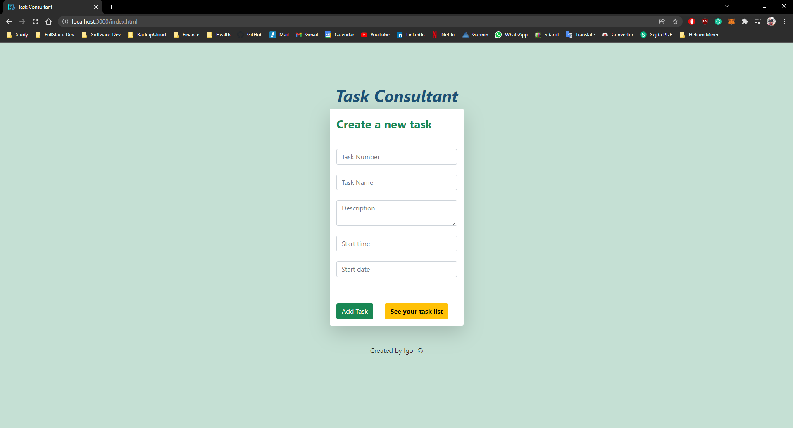
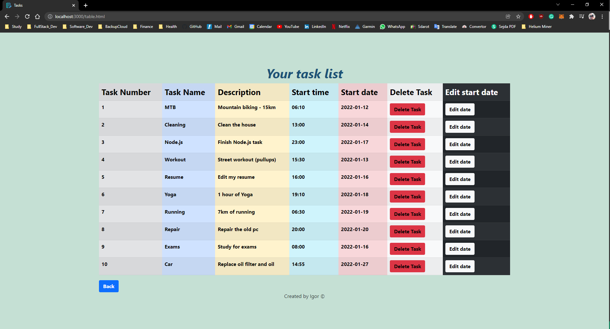
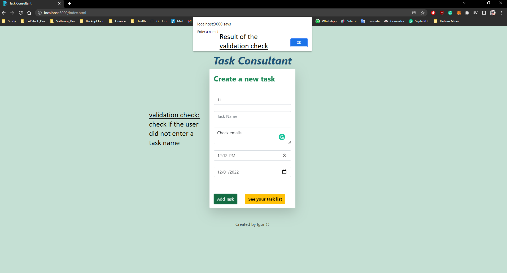

## <u><b>Task Consultant App</b></u>

## <u>Description:</u>

The app allows you to create tasks and add them to the task list.
also, you can edit the date of the task or delete a task by its name.

## <u>Screenshots of the app:</u>

 
 
Home page: 
<b>Press on "Add task" button to add a new task To see all the tasks in a separate page press on "See your task list" button.</b>

tasks table

validation check: 
<b>If task name is empty - an error will pop out and will ask for a task name</b>

 
<b>Created by Igor Marushenko<b>
